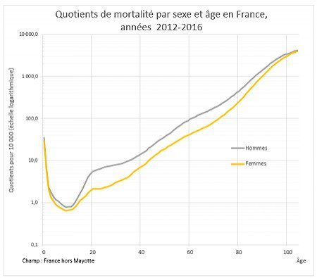

*Réponse publiée [sur Quora](https://fr.quora.com/Quelles-sont-les-probabilit%C3%A9s-que-je-meurs-%C3%A0-tout-instant/answer/Dr-Goulu)*

ça s'appelle le "quotient de mortalité", c'est la probabilité de mourir dans l'année en fonction de votre âge :

(pour une raison mystérieuse il faut cliquer ci-dessous pour faire apparaître le graphique…)

notez que l'échelle verticale est logarithmique.

En gros, c'est vers 10 ans que vous avez le moins de chances de mourir, et le risque est 30x plus faible que la première année de votre vie.

A l'adolescence, les garçons commencent à vivre plus dangereusement que les filles : à 20 ans, presque 3x plus de garçons que de filles meurent …

Ensuite vous risquez chaque année moins de mourir que la première année de votre vie jusque vers 50 ans pour les hommes, et 60 pour les femmes.

Vous dépassez 1% de chances de mourir par année après 60 ans pour les hommes et 72 ans pour les femmes

et à 100 ans, vous avez environ 30% de chances de ne pas atteindre 101 ans.

[https://www.ined.fr/fr/tout-savo...](https://web.archive.org/web/20210418123700/https://www.ined.fr/fr/tout-savoir-population/graphiques-cartes/graphiques-interpretes/risques-mortalite/)

C'est ces courbes qu'utilisent les assurances vie pour calculer votre prime…
