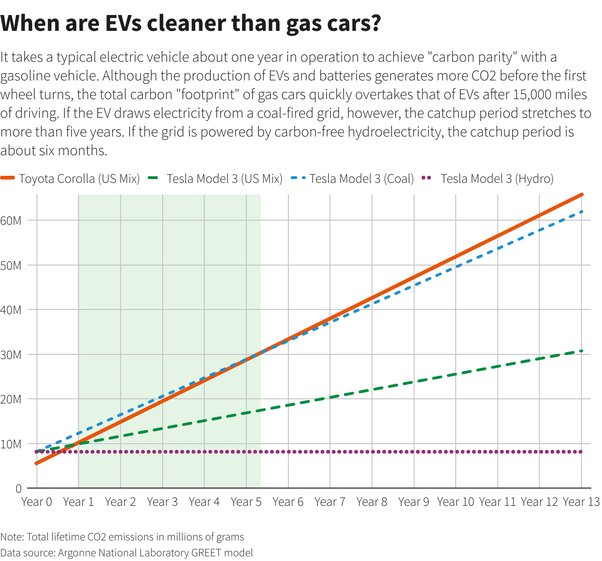

*Réponse publiée [sur Quora](https://fr.quora.com/Sachant-qu-une-auto-%C3%A9lectrique-p%C3%A8se-bien-plus-lourd-peut-on-d%C3%A9montrer-et-pas-juste-estimer-que-le-bilan-en-%C3%A9nergie-sera-positif-par-rapport-aux-motorisations-thermiques-en-tenant-compte/answer/Dr-Goulu)*

Oui. Ca s'appelle une analyse "well to wheel", du puits à la roue.

Une des plus complète est le modèle GREET du [Laboratoire national d'Argonne](w:) aux USA.

Vous pouvez télécharger leurs données ici : [https://greet.es.anl.gov/](https://web.archive.org/web/20210716132214/https://greet.es.anl.gov/)

En gros et sans surprise, tout dépend du mix énergétique utilisé pour produire l'électricité, mais en après une année environ, le surcoût énergétique de la production d'un véhicule électrique est amorti.

Si vous rechargez une Tesla Model 3 avec de l'électricité produite par une centrale à charbon, là il faudra 5 ans pour l'amortir, mais avec de l'électricité "100% propre" comme de l'hydro (ou du nucléaire…), au bout de 6 mois vous dégagez beaucoup moins de CO2 qu'avec une Toyota Corolla considérée comme équivalente.

Une étude présentée à la TV Suisse montre même que plus la voiture est "grosse", plus l'avantage est grand

[https://www.rts.ch/play/tv/redir...](https://www.rts.ch/play/tv/redirect/detail/12156237)
