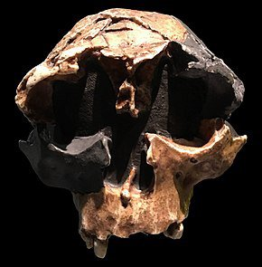

---

title: Si dans 1 millions d'années, une civilisation déterrait un crâne d'asiatique et un autre crane de noir africain, concluraient-ils qu'il s'agit de la même espèce d'homo sapiens ou feraient-ils une distinction comme nous la faisons avec Neandertal ?
slug: si-dans-1-millions-d-annees-une-civilisation-deterrait-un-crane-d-asiatique-et-un-autre-crane-de-noir-africain-concluraient-ils-qu-il-s-agit-de-la-meme-espece-d-homo-sapiens-ou-feraient-ils-une-distinction-comme-nous-la-faisons-avec
date: '2021-06-28'
draft: true
categories:
- Quora
tags: []
coverImage: ./images/qimg-14bf885ce0a9f7e3b8bf6323645ddb6f.jpg
---

*Réponse publiée [sur Quora](https://fr.quora.com/Si-dans-1-millions-d-ann%C3%A9es-une-civilisation-d%C3%A9terrait-un-cr%C3%A2ne-d-asiatique-et-un-autre-crane-de-noir-africain-concluraient-ils-qu-il-s-agit-de-la-m%C3%AAme-esp%C3%A8ce-d-homo-sapiens-ou-feraient/answer/Dr-Goulu)*

Il n'y a que dans "Les Experts" que le médecin légiste identifie l'ethnie d'un squelette au premier coup d’œil. En vrai il faut faire des analyses ADN pour le savoir, avec un certain degré de confiance.

or au bout d'un million d'années, un crâne humain bien conservé ressemble à ça :

( [Homo antecessor — Wikipédia](w:Homo_antecessor) )

et l'ADN est définitivement détruit.

Bref, l'anthropologue du futur, s'il n'est pas raciste ou plein de préjugés, n'aurait aucun élément matériel pour douter que des [Homo](w:)africains et asiatiques étaient de la même espèce.

Pour Neandertal qui vivait il y a 450'000 à 30'000 ans seulement, et dont on a des squelettes complets bien conservés, il y a des [caractéristique du squelette](w:Homme_de_Néandertal) assez nettes qui font qu'on l'a rangé dans une espèce distincte, alors qu'il y a des preuves génétiques d'hybridation qui montrent que nous formions des sous-espèces de la même espèce d'Homo, avec aussi Denisova. Mais pas Erectus, qui lui était une espèce distincte (jusqu'à preuve du contraire).
