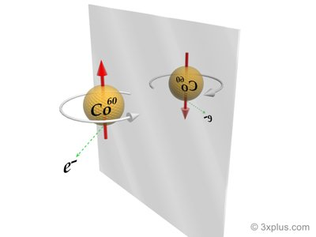

---

title: Si je communique par SMS (sans image, ni photo) avec une civilisation extraterrestre, comment avoir la même convention pour définir la droite et la gauche ? Le haut et le bas pouvant être déduit simplement par la chute d'un objet.
slug: si-je-communique-par-sms-sans-image-ni-photo-avec-une-civilisation-extraterrestre-comment-avoir-la-meme-convention-pour-definir-la-droite-et-la-gauche-le-haut-et-le-bas-pouvant-etre-deduit-simplement-par-la-chute-d-un-objet
date: '2021-05-24'
draft: true
categories:
- Comment
tags: []
coverImage: ./images/qimg-66bc584fe108482ce97bc5b882f16a34.jpg
---

*Réponse publiée [sur Quora](https://fr.quora.com/Si-je-communique-par-SMS-sans-image-ni-photo-avec-une-civilisation-extraterrestre-comment-avoir-la-m%C3%AAme-convention-pour-d%C3%A9finir-la-droite-et-la-gauche-Le-haut-et-le-bas-pouvant-%C3%AAtre/answer/Dr-Goulu)*

Extrêmement bonne question qui a motivé l'un de mes meilleurs articles

[https://www.drgoulu.com/2009/04/...](/2009/04/04/miroir/)

En résumé, si on voit les mêmes étoiles que les ET c'est facile.

Sinon il faut leur faire faire une expérience montrant la rupture de la [Parité physique](w:Parité_(physique)), par exemple

> Lors de désintégration β d’un noyau de Cobalt 60, un électron est émis dans une direction aléatoire. Mais il y en a statistiquement [1 sur un million](http://irfu.cea.fr/Phocea/Vie_des_labos/Ast/ast_technique.php?id_ast=444) de plus qui part dans la direction opposée à celle du spin du noyau que dans la direction du spin (le spin indique le sens de rotation du noyau). En regardant l’expérience dans un miroir le spin change de sens et l’électron irait très légèrement plus souvent dans la direction du spin, ce qui est contraire à l’expérience. L’interaction faible “préfère” très légèrement la rotation à gauche et on pourrait donc expliquer aux extraterrestres notre convention gauche/droite en leur transmettant ce dessin:

Sans dessin, il faut leur transmettre le schéma en [Art ASCII](w:), mais puisque le SMS c'est du binaire et qu'il a fallu établir le langage avant, on peut toujours leur transmettre un dessin comme décrit dans

[https://www.drgoulu.com/2011/09/...](/2011/09/25/comment-comptent-les-extraterrestres/)
