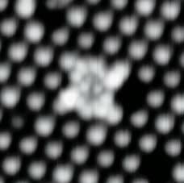

*Réponse publiée [sur Quora](https://fr.quora.com/Si-je-me-miniaturise-pour-aller-observer-des-atomes-%C3%A0-quoi-ressemblerait-vraiment-ce-que-j-aurais-devant-les-yeux/answer/Dr-Goulu)*

Vous ne verriez rien du tout parce que vos yeux et les atomes seraient plus petits que la longueur d'onde de lumière (400 à 700 nm), et que les atomes n'émettent aucun rayonnement dans des conditions normales.

Exemple : l air et les autres gaz sont transparents parce que la lumière n'interagit pas avec de petites molécules isolées (sauf à des longueurs d'onde bien précises)

Donc la vision des atomes que l'on a dépend de la technique de mesure utilisée. Avec un microscope à effet tunnel on obtient ça :

Source et explications :

[http://www.stm.baffou.com/images...](https://web.archive.org/web/20200129192959/http://www.stm.baffou.com/images.htm)
