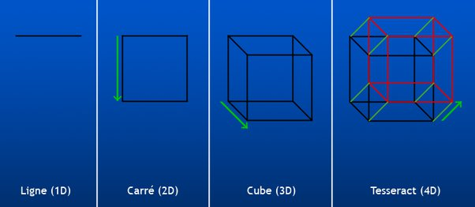

*Réponse publiée [sur Quora](https://fr.quora.com/Si-la-2%C3%A8me-dimension-a-la-1%C3%A8re-dimension-comme-%C3%A9l%C3%A9ment-et-la-3%C3%A8me-dimension-a-la-2%C3%A8me-pouvons-nous-supposer-que-la-4%C3%A8me-dimension-est-constitu%C3%A9e-de-3%C3%A8me-dimensions/answer/Dr-Goulu)*

Oui, c'est même comme ça qu'on construit des espaces (simples = euclidiens) à N dimensions

[https://www.drgoulu.com/2007/02/...](/2007/02/06/voir-en-4-dimensions/)

pour creuser le sujet, je vous recommande la série de vidos gratuites [Dimensions](http://www.dimensions-math.org/Dim_fr.htm)

Mais si c'est l'objet de votre question, l'espace-temps (à 4 dimensions) n'est pas euclidien. Il est "pseudo-euclidien" parce que la 4ème dimension a un signe négatif dans la formule de Pythagore

[https://www.drgoulu.com/2007/02/...](/2007/02/07/le-temps-une-4eme-dimension-imaginaire/)

ça a l'intéressante propriété que des "tranches" d'espace 3D selon l'axe du temps sont des "hypercônes" en 4D, qu'on appelle

[Cône de lumière](w:Cône_de_lumière)
