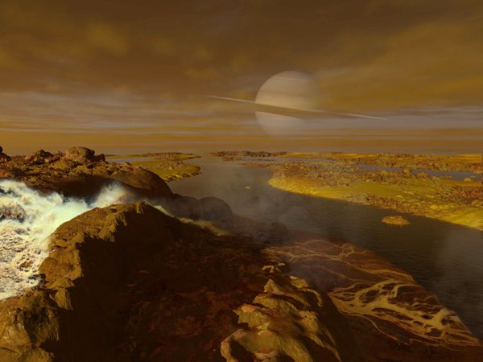

*Réponse publiée [sur Quora](https://fr.quora.com/Quelle-plan%C3%A8te-visiteriez-vous-si-vous-pouviez-aller-sur-l-une-d-entre-elles/answer/Dr-Goulu)*

La Terre.

c'est celle où on meurt le moins vite, et il y a encore 2 ou 3 endroits que je n'ai pas vus.

Sinon, la vue depuis [Titan](w:Titan_(lune)) doit être sympa, mais ce n'est pas une planète, bien qu'elle soit plus grosse que Mercure.

Ah, Titan en plein été, quand le méthane est liquide …

(peinture de [Ron Miller](https://spaceart.photoshelter.com/gallery/Titan/G0000tab463qAcLM/C0000pbGDLhg5oVQ), 1972. C'est comme les prospectus touristiques, en vrai c'est un peu moins beau…)
