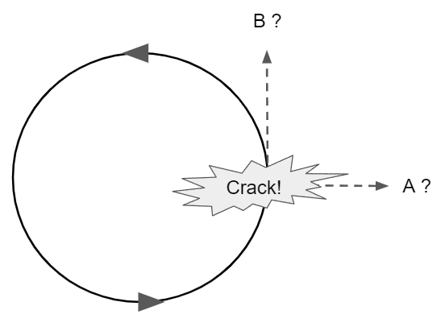

*Réponse publiée [sur Quora](https://fr.quora.com/Pourquoi-la-force-centrifuge-nous-donne-l-impression-d-acc%C3%A9l%C3%A9rer-dans-les-virages/answer/Dr-Goulu)*

Il y a déjà eu plusieurs questions similaire, mais la présence du sujet "Physique théorique" me donne l'occasion de remettre la compresse sur le fameux thème "c'est le sol qui accélère vers le haut".

Supposons que vous soyez dans un virage permanent, par exemple sur un de ces manèges où vous êtes assis sur une balançoire.

Et là, catastrophe, votre balançoire se décroche, et vous êtes éjecté du manège. QCM : où vous écrasez-vous au sol, en A ou en B ?

Si vous avez répondu A, regardez encore le lancer du poids à la télé, ou jouez encore avec une fronde : c'est B.

Parce que quand votre balançoire se décroche, vous n'êtes plus soumis à aucune force et vous continuez tout droit dans la direction de votre vitesse initiale, qui est tangente au cercle, pas perpendiculaire.

La force qui maintient la balançoire sur une trajectoire circulaire n'est pas la [Force centrifuge](w:), dirigé vers l'extérieur, mais la [Force centripète](w:), dirigée vers l'intérieur, comme le montre la direction des cordes qui tiennent la balançoire d'ailleurs : elle tirent la balançoire vers le centre du cercle.

Alors pourquoi ressent-on cette fameuse force centrifuge qui n'existe pas ? C'est parce que c'est la réaction de l'inertie contre l'accélération centripète, qui elle existe. Elle nous donne l'impression de "peser plus lourd" exactement comme l'accélération de la gravité terrestre, ce qu'on utilise d'ailleurs dans les centrifugeuses pour créer la gravité artificielle.

Et c'est là que ça devient très intéressant : quand nous sommes sur notre balance de salle de bain, est-ce que c'est nous qui appuyons sur la balance en étant accélérés à 9.81m/s2 vers le bas, ou la balance qui appuie sur nos pieds en étant accélérée à 9.81 m/s2 vers le haut ?

Pour le savoir, imaginez que le plancher craque comme dans le cas où la balançoire se décroche. Vous tombez en chute libre (jusqu'à l'étage d'en dessous). En chute libre, vous n'êtes pas accéléré car plus rien n'exerce de force sur vous. Donc la "vraie" force est celle que la balançoire exerce sur vous. La [Force de réaction du sol](https://stringfixer.com/fr/Ground_reaction_force) sur vos pieds est la vraie force, comme la centripète, alors que votre poids sur la balançoire est une force aussi fictive que la centrifuge.

A la surface de la Terre, vous êtes dans un "référentiel non inertiel" tout comme dans le manège : vous êtes accéléré par le sol vers le haut !
