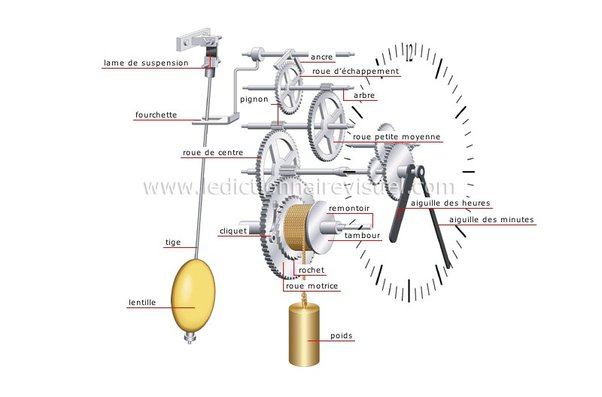

*Réponse publiée [sur Quora](https://fr.quora.com/Quest-ce-que-des-moteurs-%C3%A0-%C3%A9nergie-gravitationnelle/answer/Dr-Goulu)*

Des moteurs qui utilisent l'énergie d'une masse en hauteur pendant qu'elle descend.

le cas le plus ancien et le plus typique est celui des "horloges à poids"

Des exemples plus récents sont les moulins à eau et les centrales hydroélectriques par exemple.

Ceux qui croient qu'on peut faire de l' "énergie libre" avec la gravitation sont soit nuls en physique, soit des escrocs qui vivent sur la crédulité des premiers.

Le champ gravitationnel est un [champ conservatif](w:) : n'importe quel objet qui revient à son état de départ après avoir fait n'importe quelle trajectoire a un bilan d'énergie nul. Négatif avec les frottements.

[https://www.drgoulu.com/2012/05/...](/2012/05/27/dites-non-au-mouvement-perpetuel/)
