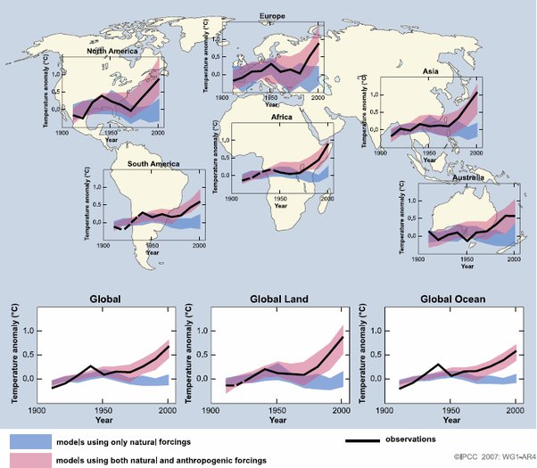

*Réponse publiée [sur Quora](https://fr.quora.com/Le-climat-de-la-Terre-a-chang%C3%A9-dans-le-pass%C3%A9-Les-causes-de-ces-changements-pass%C3%A9s-ont-elles-%C3%A9t%C3%A9-identifi%C3%A9es/answer/Dr-Goulu)*

Oui, on a des modèles de plus en plus précis, qui correspondent de mieux en mieux aux données que nous obtenons de plus en plus de sources et méthodes distinctes.

On sait maintenant que beaucoup des variations climatiques historiques étaient locales à un continent voire à un hémisphère, suite à des changements de la circulation océanique comme [El Niño](w:), l'[Oscillation atlantique multidécennale](w:) et d'autres similaires dans tous les océans du monde.

A plus long terme, les [Paramètres de Milanković](w:)de l'orbite terrestre expliquent d'autres variations, notamment les périodes glaciaires.

En tenant compte de tout ce qu'on connaît, aucun modèle ne permet d'expliquer le réchauffement actuel, le plus rapide qu'on n'ai jamais mesuré, par des phénomènes naturels, alors que c'est bien sur les deux ou trois derniers siècles qu'on a les mesures les plus précises.

Mais dès qu'on intègre les émissions de gaz à effet des serre provoquées par les humains, tout devient parfaitement cohérent :

- en bleu les résultats des modèles ne considérant que les causes naturelles
- en rouge quand on ajoute les émissions humaines
- en noir les mesures.

