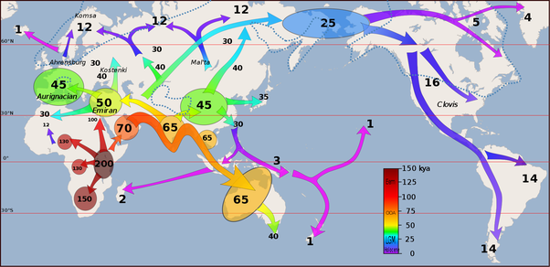

*Réponse publiée [sur Quora](https://fr.quora.com/Lhomme-a-t-il-%C3%A9volu%C3%A9-en-Afrique-seule-ou-est-ce-arriv%C3%A9-en-Am%C3%A9rique-du-Sud-en-Australie-et-en-Inde-du-Sud-une-autre-preuve/answer/Dr-Goulu)*

Il y a eu plusieurs [migrations humaines hors d'Afrique](w:Premières_migrations_humaines_hors_d'Afrique). Les premières ont commencé il y a 2 millions d'années. Quelques groupes se sont retrouvés isolés des autres êtres humains assez longtemps pour évoluer en [espèces spécifiques du genre Homo](w:Homo), comme l' [Homme de Florès](w:), ou en "sous-espèces" comme [Néandertal](w:Homme_de_Néandertal) et [Denisova](w:Homme_de_Denisova) *.

La dernière sortie d'Afrique qui a mené à l'[Expansion planétaire de l'Homme moderne](w:) a eu lieu il y a environ 70'000 ans, et comme le montre la carte ci-dessous elle a conduit notre espèce Homo Sapiens en Inde, Indonésie et Australie il y a 65'000 ans , en Europe et en Asie l y a 45'000 ans, en Amérique du Nord il y a 16'000 ans et du Sud il y a 14'000 ans

Les très faibles différences génétiques entre ces populations, comme la couleur de la peau, [l'adaptation à l'altitude](/2014/08/17/ladaptation-a-laltitude/) ou la tolérance au lactose montrent que l'évolution d'une espèce comme Homo Sapiens est permanente et efficace pour s'adapter aux environnements où elle s'installe.

Note importante * : "[sous-espèce](w:)" doit être compris dans le sens de populations ayant des caractéristiques génétiques particulières, mais toujours génétiquement compatibles entre elles. Notre espèce, "Homo Sapiens" était tout autant une sous-espèce que Néandertal et Denisova à l'époque puisque nos ancêtres se sont hybridés
