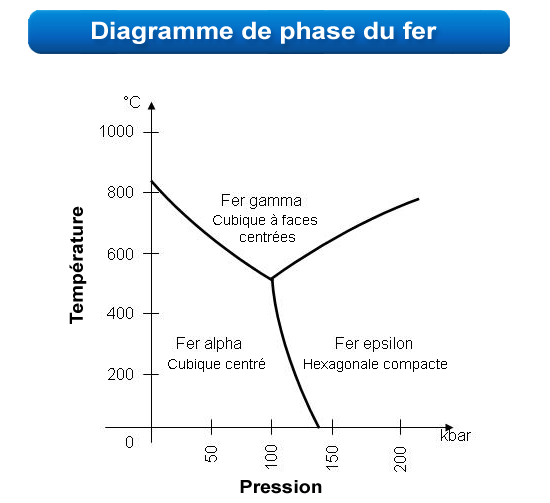

*Réponse publiée [sur Quora](https://fr.quora.com/Que-se-passerait-il-si-on-transformerait-un-m%C3%A9tal-en-un-gaz-qu-on-le-compresserait-et-qu-on-le-remettrait-%C3%A0-l-%C3%A9tat-solide/answer/Dr-Goulu)*

On ferait trois fautes de conjugaison.

Et on obtiendrait ( *Troisième personne du singulier du conditionnel*) un solide, peut-être cristallisé de manière différente en fonction de la température et de la pression

Le [Diagramme de phase](w:) vous renseignera, voici par exemple celui du Fer :

