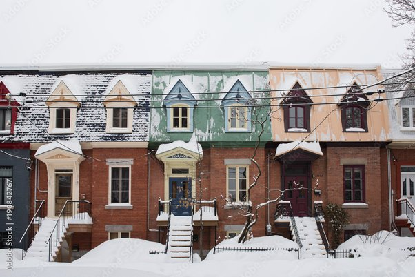
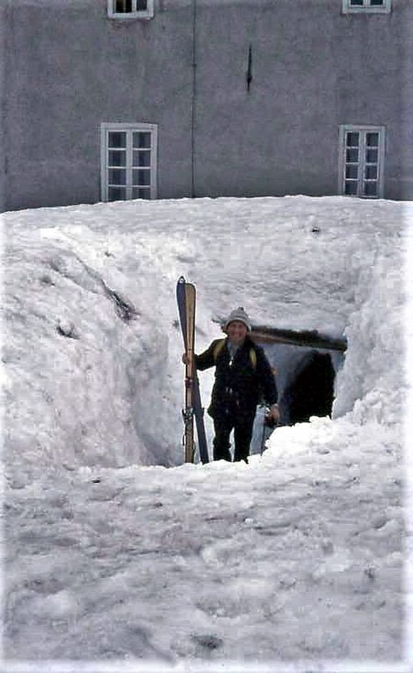

*Réponse publiée [sur Quora](https://fr.quora.com/Comment-les-gens-du-Nord-g%C3%A8rent-ils-la-neige-quand-elle-est-plus-haute-que-la-porte-d-entr%C3%A9e/answer/Dr-Goulu)*

Les prudents entrent au premier étage, comme à Montréal

Sinon, on creuse….

