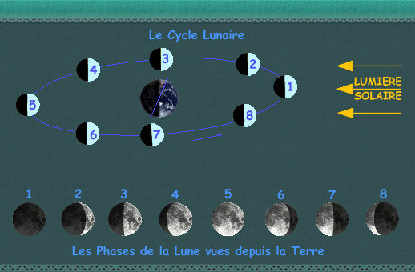
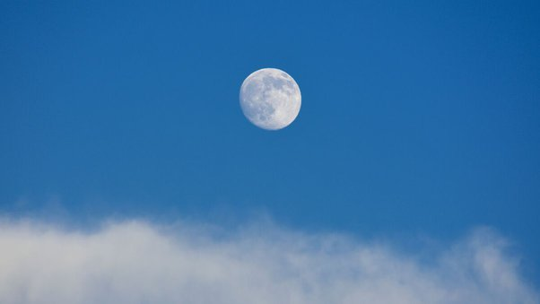

*Réponse publiée [sur Quora](https://fr.quora.com/Pourquoi-est-il-possible-de-voir-un-croissant-de-lune-et-non-la-lune-pleine-pendant-la-journ%C3%A9e-Pouvez-vous-faire-un-dessin-explicatif-Merci-beaucoup/answer/Dr-Goulu)*

La phase de la Lune n'a rien à voir avec le jour/nuit terrestre et tout avec sa position sur son orbite autour de la Terre comme cette figure le montre :

Comme le dessin ne le montre pas très bien, le plan de l'[Orbite de la Lune](w:)est incliné de 5° par rapport au plan de l'ecliptique (plan de l'orbite de la Terre) donc il arrive qu'on puisse voir la pleine Lune pendant la journée (plutôt le matin ou le soir qu'à midi, et plutôt aux hautes latitudes c'est vrai…)

