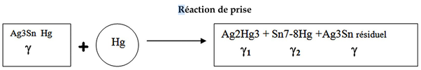

*Réponse publiée [sur Quora](https://fr.quora.com/Quelle-est-la-physique-se-cachant-derri%C3%A8re-le-ph%C3%A9nom%C3%A8ne-d-amalgamation-du-Mercure-Pourquoi-et-comment-celle-ci-peut-se-produire/answer/Dr-Goulu)*

C'est un alliage de métaux, comme quand on le fait à haute température avec des métaux fondus.

> La réaction de prise se décompose en :
>
>
>
> 1. imprégnation. L'argent et l'étain des particules diffusent dans le mercure et le mercure diffuse dans les particules d'alliage. Cette diffusion se fait par l'intermédiaire des lacunes
> 2. Amalgamation. Le mercure a une solubilité limitée dans l'argent et dans l'étain. Quand la solubilité est dépassée, les cristaux des deux composés métalliques binaires précipitent dans le mercure

source et détails : [http://campus.cerimes.fr/odontol...](http://campus.cerimes.fr/odontologie/enseignement/chap9/site/html/cours.pdf)
