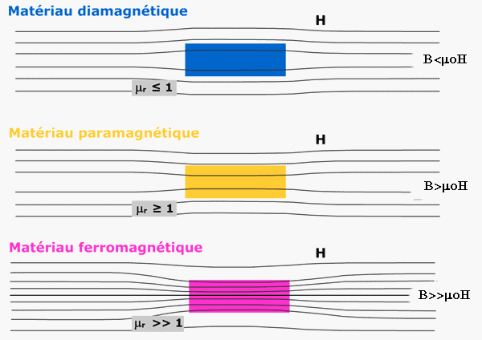

*Réponse publiée [sur Quora](https://fr.quora.com/Pourquoi-la-perm%C3%A9abilit%C3%A9-magn%C3%A9tique-pour-le-diamagn%C3%A9tique-est-elle-inf%C3%A9rieure-%C3%A0-1-et-pour-les-paramagn%C3%A9tique-est-elle-sup%C3%A9rieure-%C3%A0-1/answer/Dr-Goulu)*

Figure à mémoriser :

( source : [Perméabilité magnétique — Wikipédia](w:Perméabilité_magnétique) )
