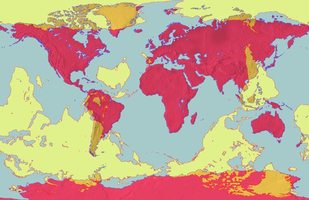

*Réponse publiée [sur Quora](https://fr.quora.com/Si-la-terre-est-ronde-cela-veux-dire-que-si-on-creuse-dans-le-sol-on-appara%C3%AEt-dans-un-autre-pays/answer/Dr-Goulu)*

En théorie oui.

Cette carte vous dit (en jaune) où par rapport à votre position (en rouge)

[Point antipodal — Wikipédia](w:Point_antipodal)
