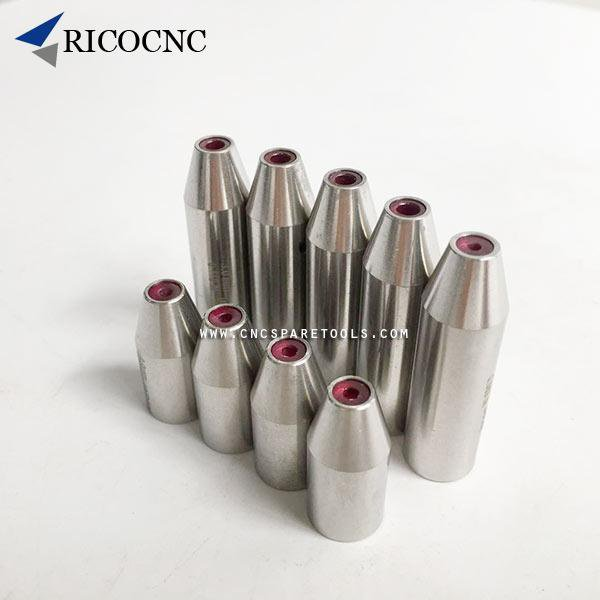

*Réponse publiée [sur Quora](https://fr.quora.com/Est-ce-que-les-rubis-sont-utilis%C3%A9s-pour-limiter-la-friction-dans-d-autres-domaines-que-l-horlogerie/answer/Dr-Goulu)*

ils sont utilisés comme guide-fils dans les machines d'[Électro-érosion](w:)

ça ressemble à ça :

(désolé, pas trouvé de bonne image sans pub…)
