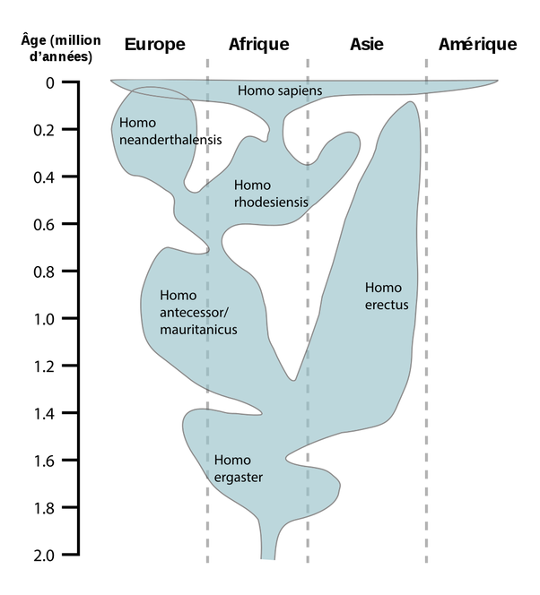

*Réponse publiée [sur Quora](https://fr.quora.com/Avant-le-genre-Homo-sapiens-il-existait-finalement-plusieurs-races-humaines-En-Europe-par-exemple-ce-sont-d-autres-Homo-mais-les-Sapiens-venu-de-la-corne-d-Afrique-serait-nos-plus-proches/answer/Dr-Goulu)*

Pour compléter la [réponse de Blandine Poitel](https://fr.quora.com/Avant-le-genre-Homo-sapiens-il-existait-finalement-plusieurs-races-humaines-En-Europe-par-exemple-ce-sont-d-autres-Homo-mais-les-Sapiens-venu-de-la-corne-d-Afrique-serait-nos-plus-proches-parents-Je-n-ai-pas/answer/Blandine-Poitel), il y a cette figure que j'aime bien car elle montre aussi la répartition géographique de quelques espèces d'Homo :

(source : [Homo — Wikipédia](w:Homo) )
