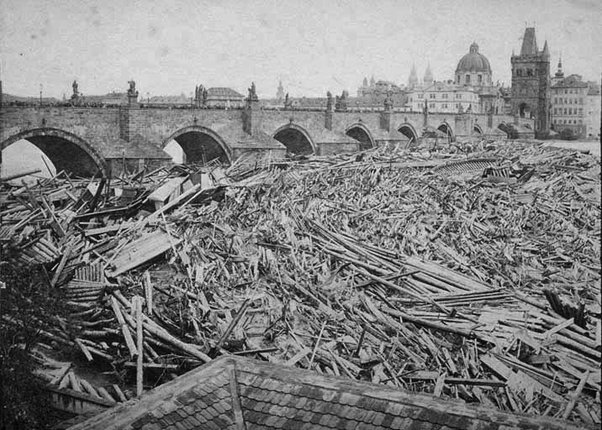

*Réponse publiée [sur Quora](https://fr.quora.com/Selon-vous-la-Chine-a-t-elle-sacrifi%C3%A9-son-environnement-pour-se-hisser-%C3%A0-son-niveau-%C3%A9conomique-actuel/answer/Dr-Goulu)*

Comme tous les pays développés avant elle.

Petits rappels historiques :

[https://fr.wikipedia.org/wiki/Gr...](w:Grand_smog_de_Londres)

( Accumulation de bois en amont du Pont Charles de Prague, en 1872 . Lire [Déforestation #Europe — Wikipédia](w:Déforestation) …)

[https://www.letemps.ch/monde/les...](https://www.letemps.ch/monde/lessence-plomb-officiellement-eradiquee-planete)

etc etc.
