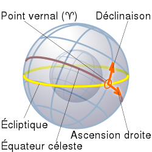

*Réponse publiée [sur Quora](https://fr.quora.com/Sur-la-Terre-nous-avons-les-coordonn%C3%A9es-d-une-ville-avec-la-latitude-et-la-longitude-mais-pour-les-%C3%A9toiles-nous-faisons-comment-%C3%A9tant-donn%C3%A9-que-nous-nous-d%C3%A9pla%C3%A7ons-constamment/answer/Dr-Goulu)*

On utilise le [Système de coordonnées équatoriales](w:):

- la [déclinaison](w:Déclinaison_(astronomie)) correspond à une latitude au dessus de l' "équateur céleste" qui est la projection de l'équateur terrestre sur la "sphère céleste" imaginaire
- l'[ascension droite](w:) correspond à une longitude mesurée sur cet équateur à partir d'un méridien passant par le "[Point vernal](w:)" qui correspond à la position du Soleil lors de l'équinoxe de mars.

