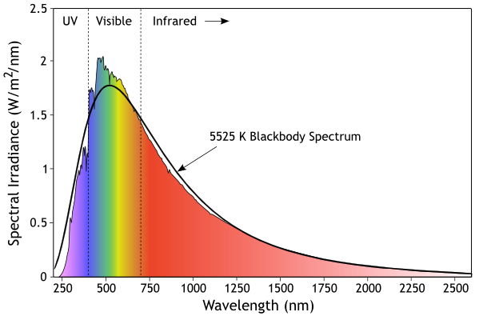
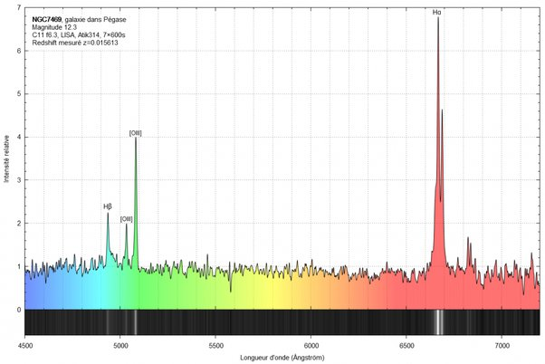

*Réponse publiée [sur Quora](https://fr.quora.com/Comment-les-scientifiques-peuvent-d%C3%A9terminer-si-un-point-lumineux-au-loin-est-une-%C3%A9toile-ou-une-galaxie/answer/Dr-Goulu)*

En examinant le [Spectre](w:Spectroscopie_astronomique) de sa lumière.

Les étoiles ont un spectre très proche du [spectre du corps noir](w:Rayonnement_du_corps_noir) correspondant à leur température de surface, avec des raies d'absorption correspondant à la composition chimique de leur atmosphère et qui définissent leur [Type spectral](w:). Voici par exemple le spectre du Soleil :

Les spectres de galaxies sont la combinaison de milliards d'étoiles de température et de compositions différentes. Il est donc beaucoup plus étalé et contient plutôt des raies d'émission correspondant aux gaz ionisés, principalement la raie [Hα](w:)de l' 'hydrogène.

C'est le décalage de cette raie qui peut être déterminé avec une extrême précision qui fournit la vitesse radiale de la galaxie, ce qui a mis en évidence le [Décalage vers le rouge](w:)des galaxies lointaines
