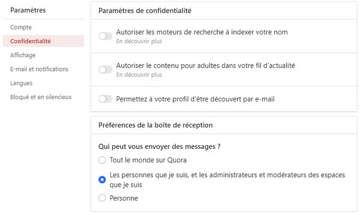
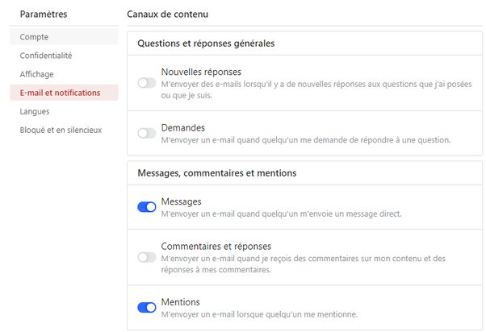

*Réponse publiée [sur Quora](https://fr.quora.com/Comment-puis-je-envoyer-un-message-priv%C3%A9-par-Quora-%C3%A0-un-autre-utilisateur-de-Quora/answer/Dr-Goulu)*

il n'y a pas de "messagerie de Quora". Vous pouvez (peut-être) envoyer un message à quelqu'un sur sa page de profil, dans le menu "trois points".

Mais chacun peut définir dans ses paramètres de qui il accepte de recevoir de messages. Chez moi c'est comme ça (je crois que c'est par défaut) :

Donc vous ne pouvez m'envoyer de message que si je vous "suis".

Autrement vous pouvez mettre un "@[Dr. Goulu](https://fr.quora.com/profile/Dr-Goulu) " dans votre réponse ou commentaire et j'en serai notifié par e-mail parce que j'ai mis :

(mais les e-mails de Quora sont rangés automatiquement à un endroit que je ne vais pas voir souvent…)
