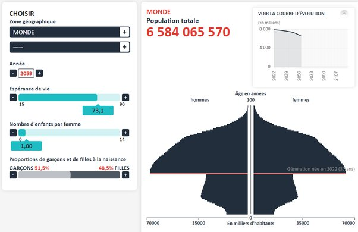

*Réponse publiée [sur Quora](https://fr.quora.com/Est-il-%C3%A9thiquement-bon-de-limiter-le-taux-de-reproduction-de-l-esp%C3%A8re-humaine-dans-sa-globalit%C3%A9-pour-l-avenir/answer/Dr-Goulu)*

Pas besoin, ça arrive tout seul, voir [Transition démographique](w:).

Et ne pas oublier que l'augmentation de la population actuelle est autant due à l'allongement de l'espérance de vie qu'aux nouvelles naissances …

Regardez la géniale présentation de Hans Rosling

[https://www.youtube.com/watch?v=...](https://www.youtube.com/watch?v=2LyzBoHo5EI)

Si vous limitez (trop) les naissances, vous allez vous retrouver avec une pyramide des âges "inversée", qui sera éthiquement insupportable pour les jeunes qui devront travailler pour un nombre important de vieux. Pas seulement payer leurs retraites, mais s'occuper d'eux …

Vous pouvez vous amuser avec le [Simulateur de population de l'INED](https://www.ined.fr/fr/tout-savoir-population/jeux/population-demain/). Par exemple si vous dites que dès maintenant chaque femme n'a le droit de faire qu'un enfant, dans 37 ans (moitié de l'espérance de vie) vous aurez un "champignon des âges" qui ressemblera à ça, et une population qui ne sera descendue qu'à 6.6 milliards, son niveau de 2006, il y a 18 ans :

