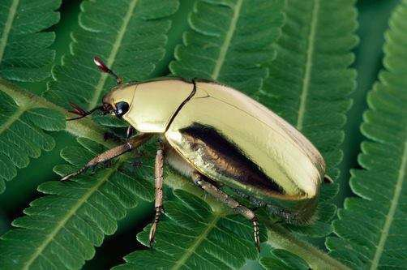

*Réponse publiée [sur Quora](https://fr.quora.com/Est-ce-qu-il-existe-des-animaux-dont-le-corps-para%C3%AEt-%C3%AAtre-recouvert-d-or/answer/Dr-Goulu)*

difficile de faire mieux que [Chrysina resplendens](w:en:Chrysina_resplendens)

[https://www.futura-sciences.com/...](https://www.futura-sciences.com/planete/actualites/animaux-scarabee-dore-couleur-unique-monde-67692/)
