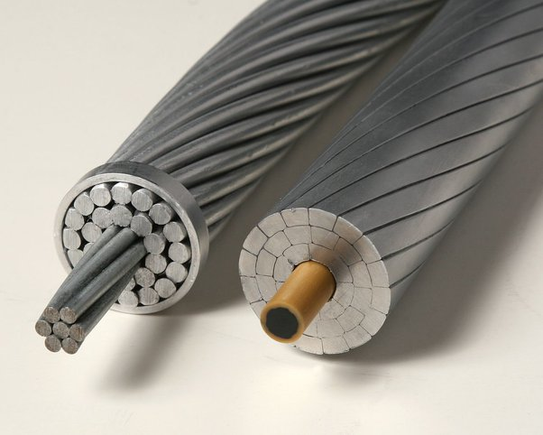

*Réponse publiée [sur Quora](https://fr.quora.com/Pourquoi-les-lignes-%C3%A9lectriques-%C3%A0-haute-tension-sont-elles-en-aluminium/answer/Dr-Goulu)*

L'aluminium offre le meilleur compromis conductivité/poids à prix abordable.

Malheureusement il n'a pas la résistance mécanique nécessaire, alors on le met souvent autour d'une âme en acier ou en composite :

(image Par Dave Bryant — Travail personnel, CC BY-SA 3.0, [Ligne à haute tension — Wikipédia](w:Ligne_à_haute_tension) )

Ca n'a pas trop d'incidence sur la conductivité en raison de l'[Effet de peau](w:).

[https://www.drgoulu.com/2010/03/...](/2010/03/19/0-01-ohmkm/)
