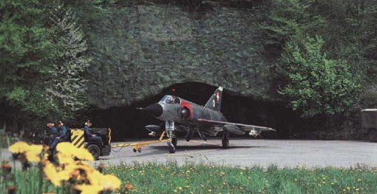
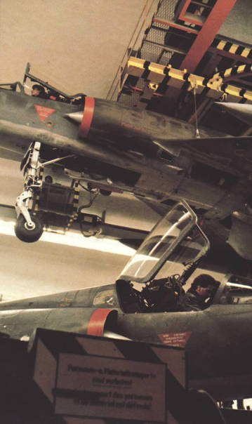

*Réponse publiée [sur Quora](https://fr.quora.com/Pourquoi-les-hangars-davions-de-chasse-ne-sont-ils-pas-souterrains-prot%C3%A9ger-ainsi-de-toutes-attaque/answer/Dr-Goulu)*

C'est une excellente idée, la preuve : on l'a eue ;-)

Mirage IIIs sortant d'une [Caverne d'avion](https://stringfixer.com/fr/Aircraft_cavern) (1984)

Stockage des avions dans les cavernes, suspendus au plafond :

autres images et infos :

[http://www.loutan.net/olivier/ar...](http://www.loutan.net/olivier/archives/2014/06/09/ouvrage-fortifie-bunker-abris-a-avion-aviation-suisse/)

[https://fr.wikipedia.org/wiki/Fo...](w:Forces_aériennes_suisses)

le truc, c'est qu'il faut une montagne juste à côté d'une vallée assez plate pour construire la piste …
