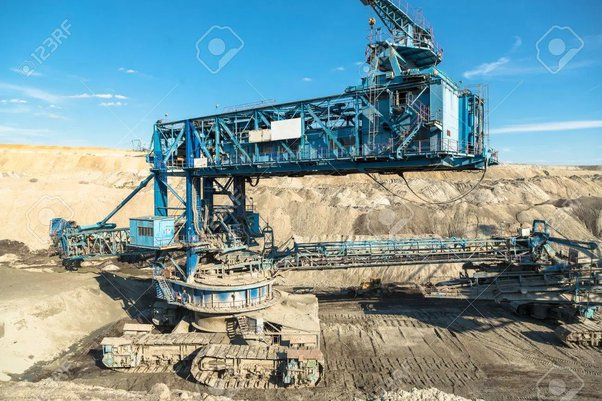

*Réponse publiée [sur Quora](https://fr.quora.com/M%C3%AAme-si-certains-en-douteront-y-a-t-il-une-chance-que-certains-engins-%C3%A9normes-et-silencieux-vus-sur-Terre-soient-fabriqu%C3%A9s-par-des-humains/answer/Dr-Goulu)*

Enorme et silencieux comme ça ?

comme ça :

(silencieux quand ça ne marche pas…)

ou comme ça ?

Jusqu'à preuve du contraire, je suis persuadé qu'ils sont fabriqués par des humains. Mais j'admets qu'il reste toujours un doute, ça peut très bien être des vaisseaux intergalactiques entourés d'un champ déviant les rayons lumineux pour nous les faire apparaître sous une forme courante à nos yeux sous-développés, l'enfance de l'art pour une technologie avancée.

Si vous pensiez à d'autres engins, merci d'en mettre une photo aussi nette et détaillée dans les commentaires svp.

Ca ne doit pas être difficile à trouver vu le milliard d'appareils photo en circulation 24/24, 7/7 …
