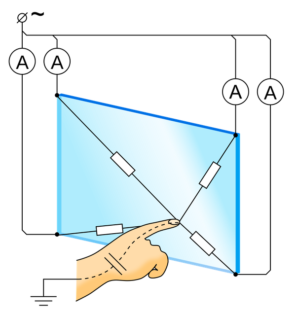

*Réponse publiée [sur Quora](https://fr.quora.com/Quelles-propri%C3%A9t%C3%A9s-permettent-%C3%A0-l%C3%A9cran-tactile-d%C3%AAtre-sensible-au-corps-humain/answer/Dr-Goulu)*

Le corps humain n'a rien de spécial, ça marche avec n'importe quel objet ayant des caractéristiques électriques similaires à un doigt.

Les [Écrans tactiles actuels utilisent la technologie capacitive:](w:Écran_tactile)

> Dans les systèmes capacitifs, une couche qui accumule les charges, à base d'[indium](w:), est placée sur la plaque de verre du moniteur. Lorsque l’utilisateur touche la plaque avec son doigt, certaines de ces charges lui sont transférées. Les charges qui quittent la plaque capacitive créent un déficit quantifiable. Avec un capteur à chacun des coins de la plaque, il est possible à tout moment de mesurer et de déterminer les coordonnées du point de contact.

