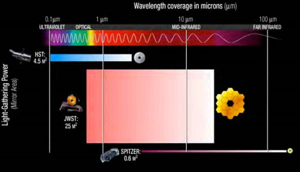

*Réponse publiée [sur Quora](https://fr.quora.com/O%C3%B9-le-t%C3%A9l%C3%A9scope-James-Webb-doit-il-regarder-pour-trouver-les-premiers-moments-de-lunivers-Dans-mon-esprit-de-n%C3%A9ophyte-il-faut-regarder-dans-la-bonne-direction-sinon-si-on-regarde-assez/answer/Dr-Goulu)*

La bonne direction, c'est le passé.

Le passé est tout autour de nous : à 1000 années lumière de distance tout autour de nous, nous voyons des astres tels qu'ils étaient il y a mille ans. À 1 million d'années lumière, nous voyons d'autres astres tels qu'ils étaient il y a un million d'années et ainsi de suite. Le temps, ce sont des pelures d'oignon autour de nous.

Il y a un siècle, Hubble (l'astronome, pas le télescope spatial…) s'est aperçu que plus on regarde des objets lointains, plus ils apparaissent rouges. Une des explications possibles est que l'univers se dilate à partir d'un moment appelé "Big Bang" où il était extrêmement chaud et dense. Si c'est vrai, alors 380'000 ans plus tard il est devenu transparent, la lumière a pu se propager dans l'espace, et on devrait pouvoir détecter ce rayonnement, dans toutes les directions.

En 1964 on a détecté ce [Fond diffus cosmologique](w:), dans toutes les directions, à une distance correspondant à l'univers il y a 13.4 milliards d'années. Des satellites comme WMAP et Planck l'ont récemment mesuré avec une incroyable précision et découvert qu'il est extraordinairement homogène : à cette époque il n'y avait aucune structure dans l'univers, il était rempli de gaz hydrogène chaud, c'est tout.

Ce fond diffus délimite à quelque chose près la limite de notre [Univers observable](w:), la partie de l'Univers visible depuis notre position. Tout le reste de l'Univers, qu'il soit infini ou pas, est définitivement hors de notre atteinte.

Une des missions de James Webb est de regarder un peu moins loin, dans la pelure d'oignon juste sous le fond diffus, deux ou trois milliards d'années après le Big Bang, quand on suppose que les premières galaxies se sont formées. C'est pour ça que le James Webb est capable d'observer dans l'infrarouge, et a donc du être placé à l'abri du Soleil, loin de la Terre.

Cette figure montre le spectre couvert par Hubble (HST) James Webb (JWST) et le [télescope spatial Spitzer](w:Spitzer_(télescope_spatial)), un télescope infrarouge beaucoup plus petit.

