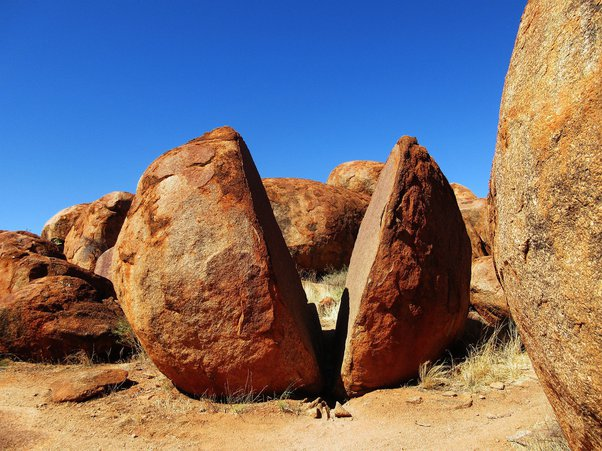
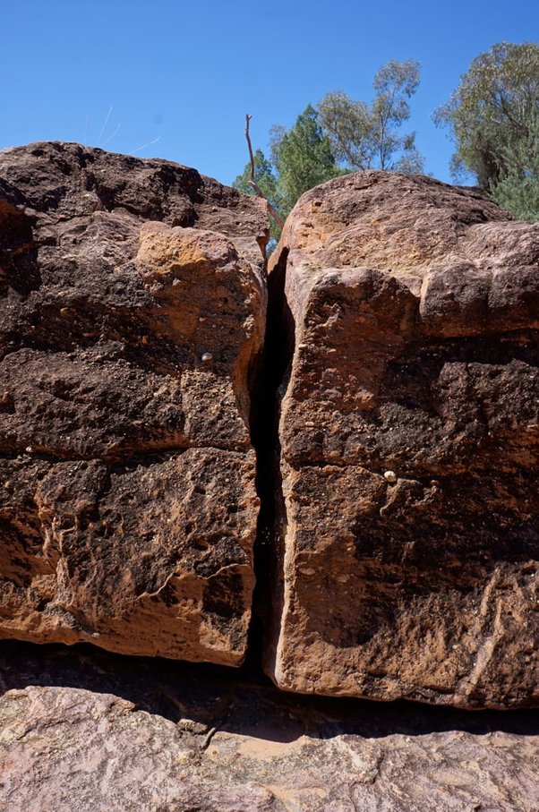
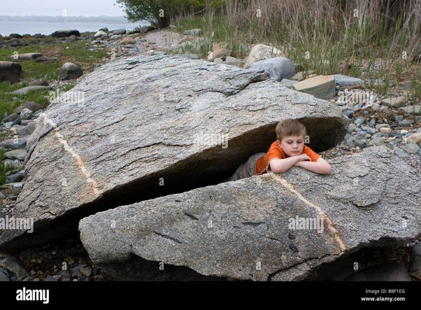

*Réponse publiée [sur Quora](https://fr.quora.com/Quelle-est-lexplication-scientifique-de-la-fente-parfaite-de-la-roche-dAl-Naslaa-Est-il-possible-de-se-passer-de-d%C3%A9coupeurs-laser/answer/Dr-Goulu)*

parfaite, parfaite … faudrait voir ça de plus près mais il y a quelques autres rochers fendus sur la planète :

Le cisaillement fait des miracles totalement hors de portée des lasers.

Aucun laser ne peut découper une pareille épaisseur de matière. Les lasers de puissance ne sont pas focalisés sur plus de quelques millimètres. Après quelques centimètres, la matière vaporisée ressort de la fente en perturbant le laser qui s'élargit, et on obtient une découpe très nettement conique.

C'est pourquoi les tailleurs de pierre préfèrent utiliser des coins frappés plutôt que des lasers.
