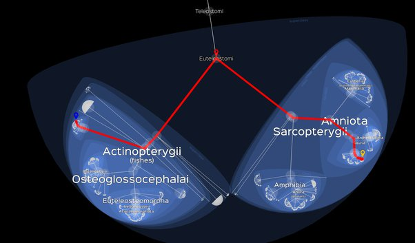

*Réponse publiée [sur Quora](https://fr.quora.com/La-mur%C3%A8ne-a-t-elle-des-liens-avec-les-serpents/answer/Dr-Goulu)*

Comme tous les êtres vivants entre eux.

voici le lien [Lifemap](http://lifemap.univ-lyon1.fr/explore.html) entre [Muraenidae](w:)à gauche et [Serpentes](w:)à droite

Si vous zoomez un peu au dessus des serpents, vous trouverez les mammifères un peu au dessus des serpents, donc

1. nous sommes à peu près à la même distance des murènes que les serpents
2. nous sommes beaucoup plus proches des serpents que des murènes.
