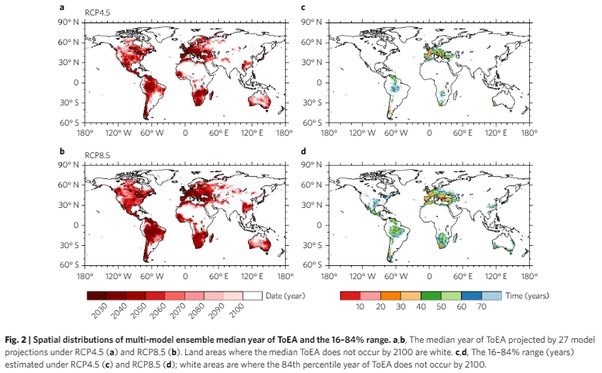

*Réponse publiée [sur Quora](https://fr.quora.com/Pourquoi-si-le-niveau-des-mers-augmente-on-pourrait-avoir-davantage-de-zones-d%C3%A9sertiques-sur-les-continents/answer/Dr-Goulu)*

il n'y a pas de relation de cause à effet directe entre ces deux phénomènes.

Ils sont tous les deux causés par le [Réchauffement climatique](w:)actuel:

- l' [Élévation du niveau de la mer](w:)est très nette, mais encore "faible", environ 20 cm depuis 1900, ce qui ne modifie pas directement les pluies. Par contre, cette élévation n'est qu'un des [Effets du réchauffement climatique sur les océans](w:). Le réchauffement des eaux de surface et leur refroidissement dans les zones où s'écoule l'eau des glaciers qui fondent modifie les courants marins. Globalement, l'effet de ceci est d'augmenter la variabilité et la violence des précipitations : il y a plus de fortes tempêtes, plus d'inondations, et de plus longues périodes sèches.
- Cette étude a étudié l'effet de ceci sur l'aridification des sols*

Park, C. E., Jeong, S. J., Joshi, M., Osborn, T. J., Ho, C. H., Piao, S., Chen, D., Liu, J., Yang, H., Park, H., Kim, B. M., & Feng, S. (2018). [Keeping global warming within 1.5 °C constrains emergence of aridification](https://doi.org/10.1038/s41558-017-0034-4). *Nature Climate Change 2017 8:1*, *8*(1), 70–74. [[pdf](https://www.nature.com/articles/s41558-017-0034-4.epdf?referrer_access_token=7FOKt6koPpM6RWkCwS6SLdRgN0jAjWel9jnR3ZoTv0Md-_o5A1rhm4JzTytmIvTkmxaaT7siHGll-VC_gYGc87KR09CzNUGzQErbO6YRUoQEpX3wULEI-jgNJ4QfMZm1N2IS8CLV45JasdEcL_wMirXslKehpibL_dCk4t7-TJkWyINxrTzillX6yXlGlsdD7riaGPM8F0f08ofgE9zWrdtJK9lLZy6l3YNYp0CwR0GghK5UOKZk6FJcZIxBcypmm37b8dgWI8H2LmwHfq4EgBsmJV8Bssz-RXxRvzgPp1g=&tracking_referrer=grist.org)]

En voici l'abstract (résumé) traduit :

> L'aridité - le rapport entre l'approvisionnement en eau atmosphérique (précipitations ; P) et la demande (évapotranspiration potentielle ; PET) - devrait diminuer (c'est-à-dire que les zones deviendront plus sèches) en conséquence du changement climatique anthropique, exacerbant dégradation et désertification.
>
>
>
> Cependant, le moment de l'aridification significative par rapport à la variabilité naturelle - défini ici comme le moment d'émergence pour l'aridification (ToEA) - est inconnu, malgré son importance dans la conception et la mise en œuvre des politiques d'atténuation.
>
>
>
> Ici, nous estimons la ToEA à partir des projections de 27 modèles climatiques mondiaux (GCM) sous les voies de concentration représentatives (RCP) RCP4.5 et RCP8.5, et ce faisant, identifions où l'émergence se produit avant que le réchauffement moyen global n'atteigne 1,5 °C et 2 °C au-dessus du niveau préindustriel. Sur la base de la ToEA médiane d'ensemble pour chaque cellule de la grille, l'aridification émerge sur 32 % (RCP4.5) et 24 % (RCP8.5) de la surface terrestre totale avant que la médiane d'ensemble du changement de température moyenne globale n'atteigne 2 °C en chaque scénario. De plus, la ToEA est évitée dans environ les deux tiers des régions ci-dessus si le niveau de réchauffement global maximal est limité à 1,5 °C. Une action précoce pour atteindre l'objectif de température de 1,5 °C peut donc réduire considérablement la probabilité que de grandes régions soient confrontées à une aridification substantielle et aux impacts connexes.

Et ils donnent une petite carte montrant à droite à quels endroits et dans combien de temps on arrivera en moyenne à l'aridification des terres sur la planète dans le scénario +1.5°C (en haut) et +2°C (en bas)

Et oui, l'Europe sera la zone la plus touchée, dans les deux cas.

Note* : juste pour ceux qui vont dire "encore un article du GIEC", je vous mets la liste des universités dans lesquelles travaillent les auteurs de cet article:

1. School of Environmental Science and Engineering, Southern University of Science and Technology (SUSTECH), Shenzhen, China.
2. Climatic Research Unit, School of Environmental Sciences, University of East Anglia, Norwich, UK.
3. School of Earth and Environmental Sciences, Seoul National University, Seoul, South Korea.
4. Key Laboratory of Alpine Ecology and Biodiversity, Institute of Tibetan Plateau Research, Chinese Academy of Sciences, Beijing, China.
5. Sino-French Institute for Earth System Science, College of Urban and Environmental Sciences, Peking University, Beijing, China.
6. Center for Excellence in Tibetan Earth Science, Chinese Academy of Sciences, Beijing, China.
7. Department of Earth Sciences, University of Gothenburg, Gothenburg, Sweden.
8. EAWAG, Swiss Federal Institute of Aquatic Science and Technology, Dübendorf, Switzerland.
9. Faculty of Sciences, University of Basel, Basel, Switzerland.
10. Korea Polar Research Institution, Incheon, Korea.
11. Department of Geosciences, University of Arkansas, Fayetteville 72701, USA
