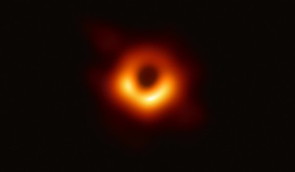
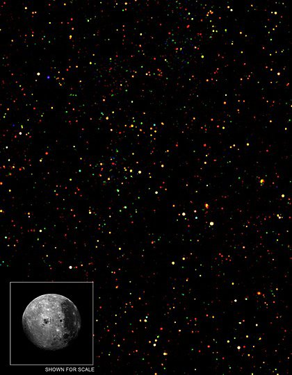
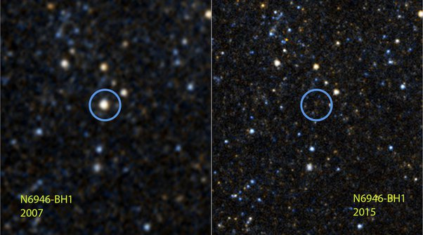

*Réponse publiée [sur Quora](https://fr.quora.com/Combien-de-trous-noirs-lHomme-a-t-il-pu-observer/answer/Dr-Goulu)*

Ca dépend de ce que vous appelez "observer".

Déjà comme ils sont encore plus noirs que le fond du ciel, ils n'émettent pas de lumière. On ne peut voir que la matière qui orbite autour d'eux à si grande vitesse qu'elle devient chaude par frottement, le [Disque d'accrétion](w:).

On a ainsi obtenu la fameuse "image" du disque d'accrétion de [M87*](w:):

J'ai mis "image" entre guillemets car en fait elle est reconstituée à partir d'ondes radio captées par des radiotélescopes de l'[Event Horizon Telescope](w:).

Indirectement, il y a de très nombreuses observations qui ne sont explicables que par la présence d'un trou noir, notamment cette extraordinaire séquence d'images du centre de notre galaxie sur une période de 10 ans[[1]](#FNuYH) :

[https://www.youtube.com/watch?v=...](https://www.youtube.com/watch?v=495OIRMV-1c)

On y voit notamment l'[étoile S2](w:S2_(étoile)) orbiter autour de quelque chose d'invisible en 10 ans, en accélérant à 2.7% de la vitesse de la lumière ! Ceci a permis de calculer la masse du [truc invisible](w:Sagittarius_A*) autour de quoi elle tourne : 4 millions de masses solaires ! C'est encore plus magnifique que de voir le trou noir pour de vrai non ?

Pour revenir aux disques d'accrétion, en fait ils sont tellement chauds qu'ils émettent des rayons X. Le problème est que les rayons X ne vont pas jusqu'au sol, alors on les observe avec des télescopes spatiaux spécialisés comme [Chandra](w:Chandra_(télescope_spatial)), qui n'ont hélas pas (encore) la résolution nécessaire pour faire de jolies images, mais peuvent faire des images comme ça:

La Lune sert à donner l'échelle de l'image, et chaque point (il y en a environ 1300) est une source de rayons X. Or les seules sources possibles de rayons X dans l'univers sont des trous noirs, ou à la rigueur des [Binaires X](w:Binaire_X), où une étoile se fait avaler par une étoile à neutrons. Il y en a peut être quelques unes dans cette image, mais comme beaucoup de points coïncident avec des galaxies, ce qu'on voit c'est surtout des [Trou noir supermassif](w:)centraux de galaxies. [C’est plein de Trous Noirs !](/2007/03/13/cest-plein-de-trous-noirs/)

En examinant le spectre de certains de ces objets, on a même été capables de mesurer

[https://www.drgoulu.com/2016/07/...](/2016/07/10/combien-tourne-un-trou-noir/)

et ça correspond exactement aux prédictions théoriques.

On a aussi observé quasiment en direct l'effondrement d'une étoile en trou noir[[2]](#NDHkd) :

([N6946-BH1](w:)avant et après…)

Donc voilà, la réponse à votre question est "entre zéro et des milliards" suivant ce que vous appelez "observer".

C'est un peu comme si vous demandiez combien de virus on a observé, en fait.

Notes de bas de page

[[1]](#cite-FNuYH)[Motion of "S2" and other stars  around the central Black Hole](https://www.eso.org/public/videos/eso0226a/)

[[2]](#cite-NDHkd)[Les astronomes ont observé l'effondrement d'une étoile supergéante en trou noir !](https://www.science-et-vie.com/ciel-et-espace/les-astronomes-ont-observe-l-effondrement-d-une-etoile-supergeante-en-trou-noir-8659)
