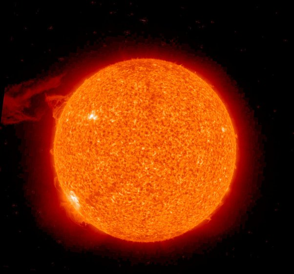
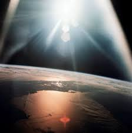
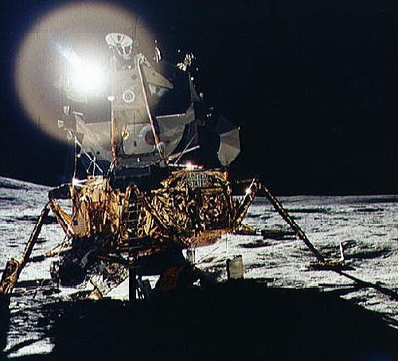
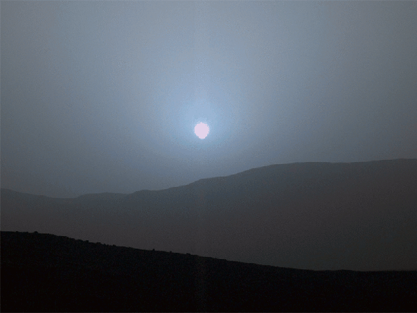

*Réponse publiée [sur Quora](https://fr.quora.com/Pourquoi-le-soleil-nest-il-pas-visible-ou-facilement-identifiable-sur-aucune-des-images-que-nous-avons-de-lespace/answer/Dr-Goulu)*

Hahaha quel gag! On a des milliers d'images du soleil prises de l'espace. On a même envoyé des satellites que pour faire ça, par exemple [STEREO](w:)qui en prend des [images en temps réel](https://stereo.gsfc.nasa.gov/) depuis 10 ans. Par exemple celle là :

Sinon il y a beaucoup d'autres photos du soleil prises depuis les missions Apollo

Depuis Mars

Et depuis Jupiter, il y a ce film fait par la sonde Juno en approche de Ganymède, où vous voyez le Soleil tout au début:

[https://www.youtube.com/watch?v=...](https://www.youtube.com/watch?v=CC7OJ7gFLvE&t=27s)

et depuis Saturne, et depuis les sondes Voyager etc etc.

Quant au "facilement identifiable" c est assez simple : c'est le truc le plus brillant que vous voyez.
