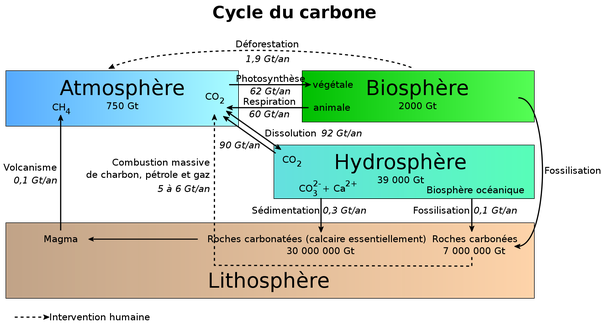
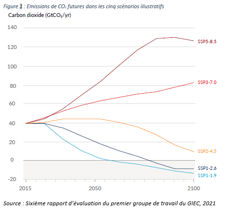
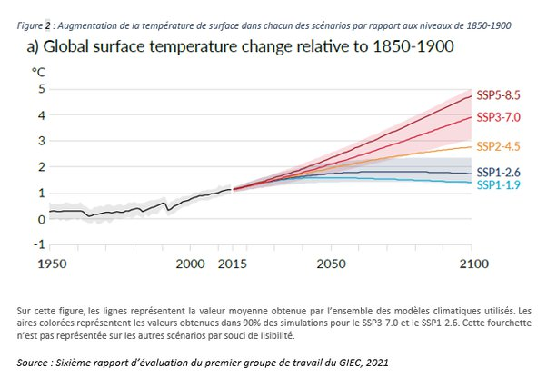

*Réponse publiée [sur Quora](https://fr.quora.com/Pourquoi-lessentiel-des-politiques-vertes-se-concentre-t-il-sur-le-CO2-alors-que-lon-sait-que-celui-ci-naura-pas-une-influence-majeure-sur-la-catastrophe-climatique-qui-sest-amorc%C3%A9e/answer/Dr-Goulu)*

Les certitudes catastrophistes de votre réponse à votre propre question font plaisir à voir, jeune homme ;-)

En fait non, "l'on" sait au contraire que nos émissions de CO2 dans les années futures auront une influence majeure sur la catastrophe climatique en cours, parce que "fort heureusement" les océans absorbent environ 2 Gt de carbone par an (ça les acidifie, mais on s'occupera de ça plus tard…) et la biosphère en fixe 2 Gt de plus,

(source [Cycle du carbone — Wikipédia](w:Cycle_du_carbone) )

donc si "l'on" réduit nos émissions de 2/3, le CO2 n'augmentera plus dans l'atmosphère. Pour reprendre vos chiffres (qui sont faux), si on crame tout en 1 siècle au lieu de 50 ans, ça fait justement une baisse de moitié (en baissant aussi la déforestation de moitié…)

ces considérations donnent lieu aux fameux "[scénarios du GIEC ?](https://www.i4ce.org/dou-viennent-les-cinq-nouveaux-scenarios-du-giec-climat/)" résumé dans la figure ci-dessous tirée de leur tout récent rapport :

avec les variations de température attendues

"L'on" voit donc qu'une réduction de moitié des émissions d'ici 2050, ce qui parait optimiste mais pas totalement délirant, permettrait de limiter le réchauffement à 2°C vers 2070 et d'amorcer une baisse encore ce siècle.

Mon réalisme me pousse plutôt à penser que vous suivrez plutôt le SSP2–4.5, avec max 3°C pendant le siècle prochain. Et en cas de scénario "rouge", il restera toujours la [Géo-ingénierie](w:), avec une petite préférence personnelle pour le parasol spatial…

Et pourquoi "vous" ? parce que le graphique le montre très bien : c'est vers 2050 que vous saurez quel scénario est appliqué dans les faits, et moi je serai à l'EMS (= votre EHPAD) dans le meilleur des cas.

Note : l'échelle verticale du graphique du GIEC mentionne des Giga tonnes de CO2, et pas de Carbone comme dans le graphique du haut. le Carbone ne représentant que 27.3% de la masse du CO2, on a 40*0.273 = 11 Gt de Carbone, inclus la déforestation, donc on a en effet actuellement un dégagement anthropique de carbone supérieur au 8 Gt indiqués dans la figure qui date un peu, donc il faut réduire ce dégagement de 2/3 et pas de 1/2 pour atteindre un équilibre
