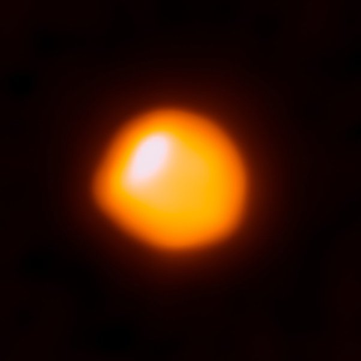
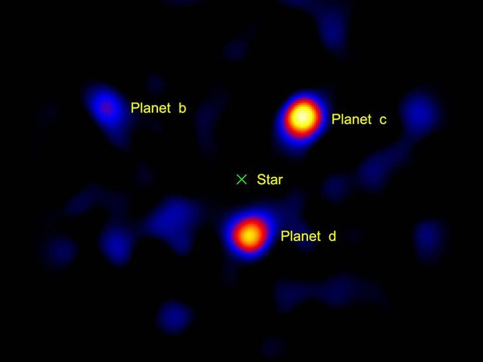
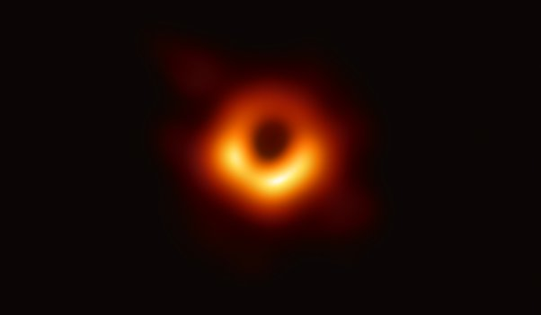

*Réponse publiée [sur Quora](https://fr.quora.com/Comment-les-gens-peuvent-ils-explorer-des-plan%C3%A8tes-ou-des-trous-noirs-sils-se-trouvent-%C3%A0-des-milliers-dann%C3%A9es-lumi%C3%A8re-Jai-vu-une-vid%C3%A9o-qui-contenait-m%C3%AAme-le-son-dun/answer/Dr-Goulu)*

Les vidéos d'astres lointains sont des simulations. Aucune sonde n'est sortie du système solaire et les meilleurs images que les meilleurs des télescopes puissent faire c'est ça :

Image de Betelgeuse, une géante rouge presque aussi grosse que notre système solaire

Une des très rares images directes d'exoplanètes autour d'une étoile (HR8799) cachée par un coronographe

(Vortex coronagraph on a 1.5m portion of the Hale telescope. Credit: NASA/JPL-Caltech/Palomar Observatory)

Et bien sur

La première image d'un trou noir, celui de la galaxie M87 prise en 2019 par l'Event Horizon Telescope

Tout ce que vous voyez comme objets extra solaires de meilleure qualité que ca sont des vues d'artistes plus ou moins rigoureusement inspirées par les connaissances scientifiques.

Certains se sont amusés à transposer dans le domaine audible des signaux radioastronomiques …pourquoi pas si le spectateur en est informé …
