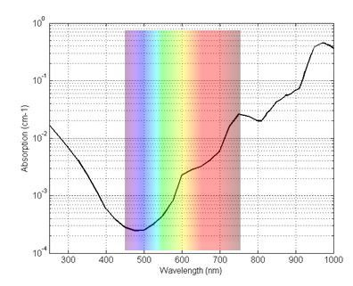

*Réponse publiée [sur Quora](https://fr.quora.com/Pourquoi-l-oc%C3%A9an-est-il-bleu-alors-que-la-couleur-de-l-eau-dans-un-verre-n-est-pas-bleue/answer/Dr-Goulu)*

parce que votre verre n'est pas assez grand, et vos yeux pas assez bons pour voir que la lumière qui le traverse a déjà perdu un peu de couleurs.

Le graphique ci-dessous montre la courbe d'absorption de la lumière par l'eau:

(source [La transparence de l'eau](https://robert-space.fr/physique/transparence-eau.html) )

Vous voyez:

1. que chaque centimètre d'eau absorbe environ 1% du rouge
2. mais seulement 0.03% du bleu
