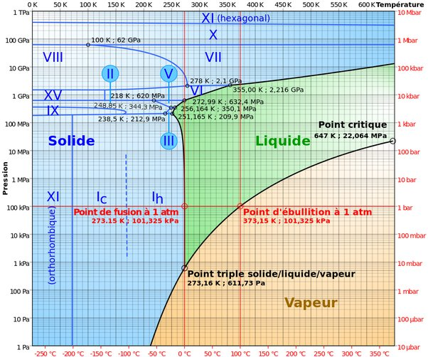

*Réponse publiée [sur Quora](https://fr.quora.com/Jusqu-%C3%A0-quel-point-peut-on-faire-baisser-ou-augmenter-le-niveau-de-la-temp%C3%A9rature-d-%C3%A9bullition-de-l-eau/answer/Dr-Goulu)*

La réponse est dans le [Diagramme de phase](w:)de l'eau:

Du point triple (pour des pressions plus basses il n'y a pas d'eau liquide, donc pas d'ébullition mais de la sublimation) jusqu'au point critique (plus haut il n'y a pas de distinction liquide/gaz)
