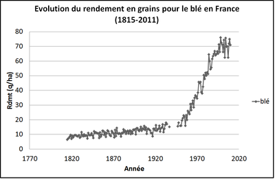
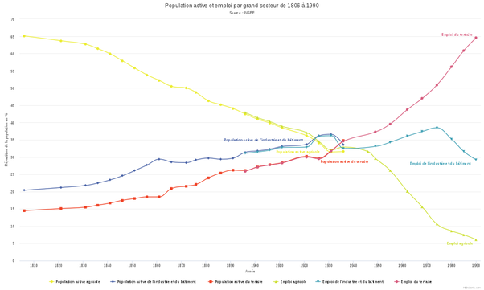

*Réponse publiée [sur Quora](https://fr.quora.com/Pourrait-on-produire-%C3%A0-nouveau-du-bl%C3%A9-comme-aux-si%C3%A8cles-derniers/answer/Dr-Goulu)*

(source : [La production de grain](http://acces.ens-lyon.fr/acces/thematiques/biodiversite/dossiers-thematiques/poacees/la-production-de-ble-1/la-production-de-ble) )

donc en utilisant 7 à 10 fois plus de surface (peut-être un peu moins en utilisant les céréales sélectionnées récemment) et au moins 7 à 10 fois plus d'agriculteurs (parce qu'on renonce aux machines) donc que la population comprenne à nouveau environ 2/3 d'agriculteurs, on devrait y arriver…

(source [Loi des trois secteurs — Wikipédia](w:Loi_des_trois_secteurs) )
