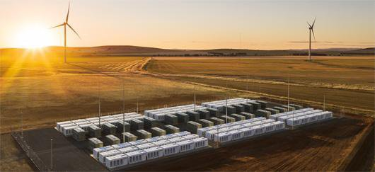

*Réponse publiée [sur Quora](https://fr.quora.com/%C3%80-quoi-ressemblerait-une-batterie-%C3%A9lectrique-similaire-%C3%A0-l-%C3%A9nergie-qu-un-homme-dispose-dans-sa-vie-Chauffage-%C3%A0-37-7-pendant-80-ans-capacit%C3%A9-motrice-etc/answer/Dr-Goulu)*

un être humain consomme environ 200 watt de moyenne (100 au repos, 300 en activité[[1]](#OShVW) )

ça correspond donc à 0.2*24*365*80=140'160 kilowattheures pendant sa vie de 80 ans.

Ca fait à peu près une [« batterie géante » de Tesla comme celle en service dans le sud de l'Australie](https://www.connaissancedesenergies.org/la-batterie-geante-de-tesla-mise-en-service-dans-le-sud-de-laustralie-220218) :

une autre façon de voir ça est de considérer la [Densité massique d'énergie](w:) d'une batterie lithium-ion, qui est de 0.5 kWh/kg. il vous en faut donc 280 tonnes pour stocker les 140'000 kWh.

C'est tellement plus que je pensais qu'on va vérifier par un détour : la densité massique d'énergie du sucre et des protéines est de 4.7 kWh/kg, presque 10x plus que la batterie ! (et les graisses c'est 10.2, plus 20x plus)

Donc il nous faut bouffer 140'160/4.7 = 30 tonnes de sucre et de protéines pendant notre vie, soit

30'000/80/365=1kg par jour

10x plus que les recommandations de l'OMS… ya une bulle… mais je vois pas où …

Notes de bas de page

[[1]](#cite-OShVW)[Le bilan thermique du corps humain - Enseignement scientifique - Première](https://www.assistancescolaire.com/eleve/1re/enseignement-scientifique/reviser-le-cours/1_sci_20)
