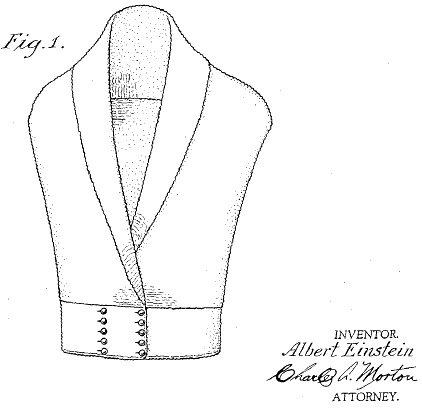

*Réponse publiée [sur Quora](https://fr.quora.com/Quelles-inventions-ne-sont-pas-assez-connues-pour-ce-qu-elles-sont/answer/Dr-Goulu)*

La blouse d'Albert Einstein.

Après la relativité, le mouvement brownien, l'équivalence masse-énergie, l'effet photoélectrique et son prix Nobel, Albert au sommet de sa gloire s'est consacré à la mode et à conçu une blouse assez révolutionnaire pour être brevetée ([USD101756S - Design for a blouse](https://patents.google.com/patent/USD101756S/))

Et personne ne la porte…

