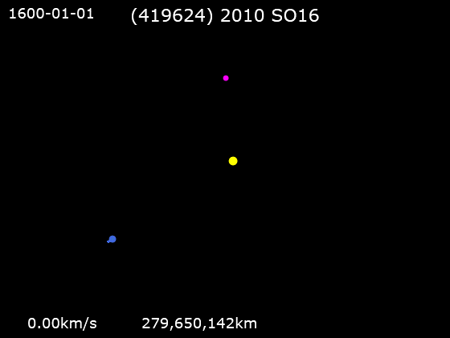

*Réponse publiée [sur Quora](https://fr.quora.com/Est-ce-qu-un-satellite-naturel-peut-changer-d-orbite-si-elle-s-%C3%A9loigne-sufisamment-de-la-plan%C3%A8te-%C3%A0-laquelle-elle-est-associ%C3%A9/answer/Dr-Goulu)*

Je ne sais pas si ça correspond à la question, mais il existe des [Quasi-satellites](w:Quasi-satellite)qui ont des orbites, ou plutôt des trajectoires périodiques vraiment étranges.

Il y a par exemple [(419624) 2010 SO16](w:)qui a une des [Orbite en fer à cheval](w:)oscillant autour de l'orbite terrestre :

On connait 9 quasi satellites de la Terre, 2 de Vénus, 1 de Mars et 9 de Jupiter.
