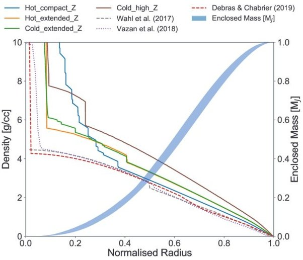

*Réponse publiée [sur Quora](https://fr.quora.com/Un-s%C3%A9jour-de-quelques-semaines-sur-Jupiter-augmenterait-il-la-masse-musculaire-des-astronautes/answer/Dr-Goulu)*

Jupiter n'a pas de surface solide. Le vaisseau de votre astronaute coulerait dans l'[Atmosphère de Jupiter](w:) jusqu'à une profondeur correspondant à sa densité, où il flotterait en équilibre entre son poids et la poussée d'Archimède. Et là, tout dépend de la gravité, en effet.

Alors pour fixer les idées, considérons un vaisseau de densité 1, comme l'eau ou un sous-marin terrestre.

D'après cette figure trouvée sur

[https://www.researchgate.net/pub...](https://www.researchgate.net/publication/341355937_The_challenge_of_forming_a_fuzzy_core_in_Jupiter/figures?lo=1)

ça arrive vers 90% du "rayon normalisé" de Jupiter

