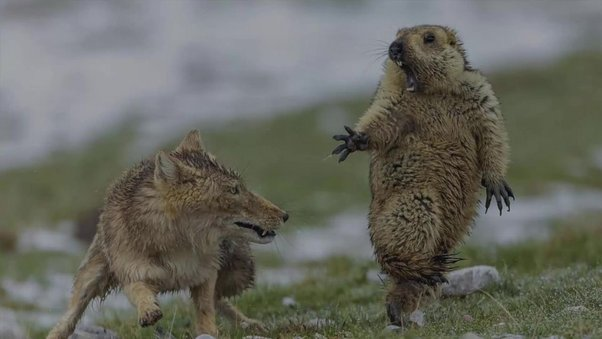

*Réponse publiée [sur Quora](https://fr.quora.com/Des-esp%C3%A8ces-animales-diff%C3%A9rentes-peuvent-elles-communiquer-entre-elles-et-se-comprendre-lors-de-leur-premi%C3%A8re-rencontre/answer/Dr-Goulu)*

(photo de Youngqing Bao, lauréat du prix Wildlife photographer of the year 2019)

Pas besoin de beaucoup anthropomorphiser cette première (et dernière) rencontre pour saisir le sens profond de leur communication silencieuse…
