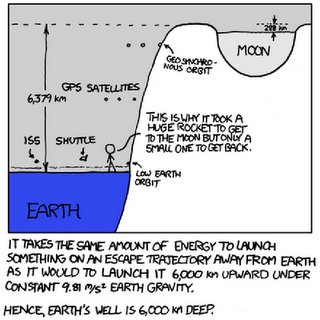

*Réponse publiée [sur Quora](https://fr.quora.com/Pourquoi-lISS-na-t-elle-pas-%C3%A9t%C3%A9-plac%C3%A9e-%C3%A0-la-m%C3%AAme-altitude-que-la-Lune-Si-vous-connaissez-Kepler-il-sera-int%C3%A9ressant-de-le-justifier-aupr%C3%A8s-de-chers-astronautes/answer/Dr-Goulu)*

Parce que la Lune est 20 fois plus "haut" que l'ISS dans le puits gravitationnel de la Terre. Chaque vol vers l'ISS aurait nécessité une Saturn-V, la fusée la plus puissante et la plus chère jamais construite.

Tout ça pour la même apesanteur et une observation de la Terre nettement moins bonne.

[https://www.drgoulu.com/2012/09/...](/2012/09/05/un-petit-pas-pour-lhomme/#.YoXEh2m-g0F)

(la remarque sur Kepler et les astronautes est incompréhensible)
