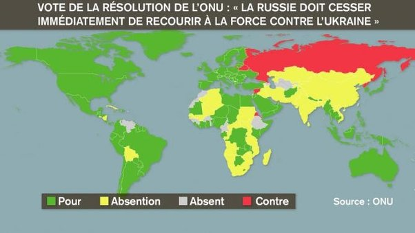

*Réponse publiée [sur Quora](https://fr.quora.com/Pourquoi-Poutine-a-tant-de-soutien-%C3%A0-travers-le-monde-malgr%C3%A9-les-d%C3%A9g%C3%A2ts-en-Ukraine-et-la-campagne-des-m%C3%A9dias-et-gouvernements-occidentaux/answer/Dr-Goulu)*

Quel soutien dans le monde svp ?

Sur les 193 membres de l'ONU, 141 pays ont approuvé le texte "*exigeant que la Russie cesse immédiatement de recourir à la force contre l'Ukraine.*", donc de loin pas seulement les pays occidentaux

Seuls **Cinq** s'y sont cependant opposés : la Russie, la Biélorussie, la Corée du Nord, l'Erythrée et la Syrie.

Voilà les amis de la Russie : 4 dictateurs.

Vous avez d'autres noms à ajouter à la liste ?
