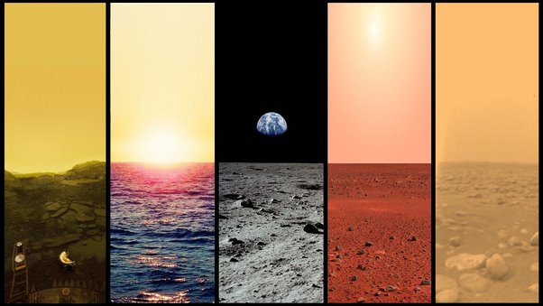

*Réponse publiée [sur Quora](https://fr.quora.com/Pourquoi-existe-t-il-un-ciel-et-une-terre/answer/Dr-Goulu)*

Il existe des milliards de planètes rien que dans notre galaxie, et chacune a son ciel en fonction de son étoile, de ses satellites et de son atmosphère.

Rien que dans notre système solaire, voici à quoi ressemble le ciel depuis les différents astres que nous ou nos sondes avons visité :

> **Il y a plus de choses dans le ciel et sur la terre que n'en rêve votre philosophie.**
>
>
>
> (Shakespeare - Hamlet)
