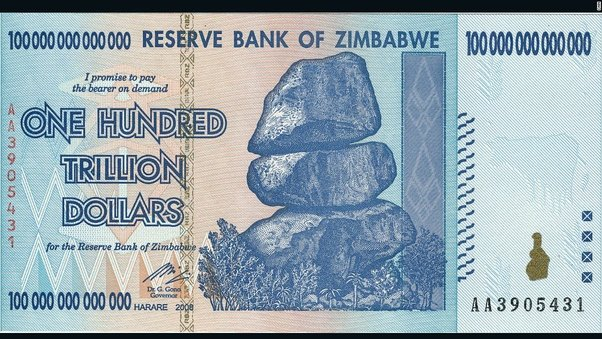

*Réponse publiée [sur Quora](https://fr.quora.com/Pourquoi-les-pays-comme-les-USA-ou-la-France-n-augmentent-ils-pas-simplement-leur-production-d-argent-dans-les-usines-de-fabrique-de-billets-%C3%A0-fin-de-financer-leurs-projets-sans-risque-de/answer/Dr-Goulu)*

Parce quand on fait ça, ça donne ça :

J'ai vu un billet comme ça en Namibie dans une station service qui indiquait ne plus accepter les dollars du Zimbabwe.

J'ai demandé au pompiste ce qu'on pouvait acheter avec ça, il m'a dit "hier, un coca, aujourd'hui je ne sais pas…"

Si vous émettez des titres sans valeur correspondante, ils ne valent rien.
