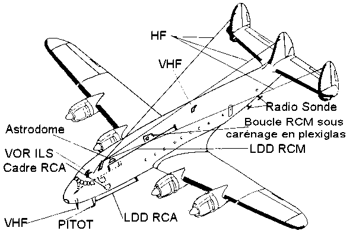

*Réponse publiée [sur Quora](https://fr.quora.com/%C3%80-quoi-servait-cette-corde-qui-reliait-la-d%C3%A9rive-au-fuselage-sur-certains-anciens-avions-comme-par-exemple-le-Lockheed-constellation/answer/Dr-Goulu)*

C'était les ntennes radio.

[https://aviatechno.net/constella...](https://aviatechno.net/constellation/antennes.php)
